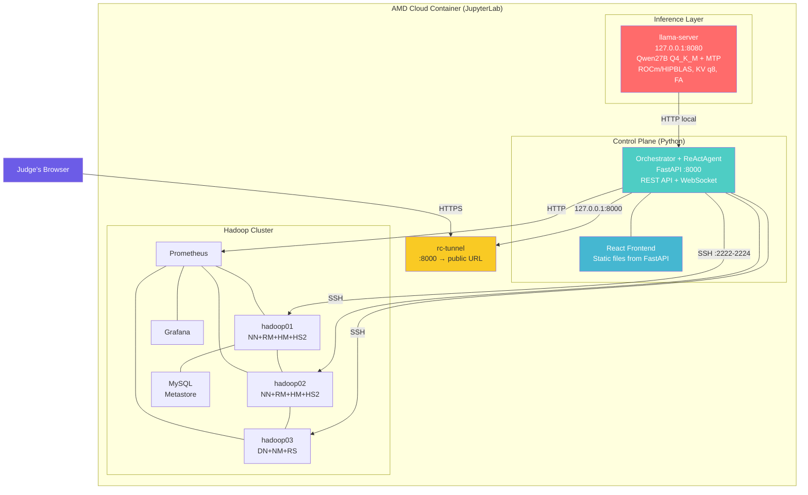

# AIOps Agent — Autonomous Hadoop Cluster Operations on AMD Radeon GPU

> **English** | [中文](./README_ZH.md)
>
> **Track 2: Development & Local Deployment of Private AI Agents**
>
> An autonomous AIOps agent that monitors, diagnoses, and repairs a Hadoop cluster — powered by a 27B LLM running locally on AMD Radeon GPU (ROCm/HIPBLAS), with zero-trust safety guardrails, knowledge base RAG, and a real-time web console.
>
> **Cluster modes:**
> - **Local single-node**: Direct install on AMD Cloud host (no Docker required, no HA)
> - **Remote 3-node HA**: Connect to a remote Docker-based Hadoop HA cluster via SSH
>
> **Note**: AMD Cloud JupyterLab containers do not support Docker-in-Docker (missing `CAP_SYS_ADMIN`, seccomp blocks user namespaces). The local single-node mode bypasses this limitation. See `docs/DESIGN.md` Appendix B for details.

---

## Table of Contents

- [Architecture](#architecture)
- [Key Features](#key-features)
- [Reproduction Guide](#reproduction-guide)
- [One-Click Demo](#one-click-demo)
- [Performance](#performance)
- [Safety Guardrail](#safety-guardrail-21-dual-axis-four-tier)
- [Web Console](#web-console)
- [Project Structure](#project-structure)
- [Configuration](#configuration)
- [ROCm Optimization](#rocm--radeon-gpu-optimization)
- [Tech Stack](#tech-stack)

---

## Architecture

All components run on a single AMD Cloud instance:



### System Layers

| Layer | Component | Technology |
|-------|-----------|------------|
| Inference | llama-server (local) | llama.cpp + ROCm/HIPBLAS, Qwen27B Q4_K_M, MTP speculative decoding |
| Control | Orchestrator + ReActAgent | Python, FastAPI, WebSocket |
| Data | Hadoop 3-node HA cluster | Docker-in-Docker: HDFS HA + YARN HA + Hive + HBase + ZK |
| Monitoring | Prometheus + Grafana | JMX Exporter → Prometheus → Grafana dashboards |
| Frontend | React + Ant Design | Vite build → FastAPI static hosting (single port) |
| Knowledge | SQLite + bge-small-zh | Hybrid RAG: vector + BM25, CPU embedding |

---

## Key Features

1. **24h Autonomous Loop** — Periodic inspection (`/auto`) + alert-driven repair (`/fix`) with preemption
2. **LLM-Driven Anomaly Detection** — Agent analyzes `hdfs report` / `metrics` / `logs` output to detect unknown faults (not just pre-coded alerts)
3. **Safety Guardrails** — Risk classification (low → irreversible), dry-run, approval gate, audit log, circuit breaker, rollback
4. **Knowledge Base RAG** — Hybrid vector + BM25 search, agent writes runbooks after fixes (confidence-gated + human review)
5. **ROCm Optimization** — HIPBLAS compile, KV q8_0, Flash Attention, MTP speculative decoding (+30% throughput)
6. **Context Engineering** — One-shot context per session + DB state card + tool output pre-compression (keeps context ≤16k)

---

## Reproduction Guide

### Prerequisites

- An AMD Cloud instance with Radeon GPU (W7900D 48GB)
- JupyterLab terminal access (or SSH)
- ROCm pre-installed (AMD Cloud default)

### Step 1: Clone the Repository

```bash
cd /workspace
git clone <your-repo-url> Radeon-hackathon
cd Radeon-hackathon
```

### Step 2: One-Click Deploy

```bash
bash scripts/setup-cloud.sh
```

This script automatically performs **all** of the following (idempotent — safe to re-run):

| Step | Action | Time |
|------|--------|------|
| 1 | Compile llama.cpp with ROCm/HIPBLAS | ~10-15 min (first time) |
| 2 | Download model + start llama-server (via `bootstrap.sh`) | ~5-10 min |
| 3 | Install Docker (Docker-in-Docker) | ~2 min |
| 4 | Hadoop cluster (see below for 3 paths) | ~2-15 min |
| 5 | Install Python dependencies | ~1 min |
| 6 | Build React frontend (production) | ~1 min |
| 7 | Generate `.env` + start Agent + Web | ~10s |
| 8 | Expose via rc-tunnel (public URL) | ~5s |

**Total: ~5 min (full backup) / ~30-40 min (from scratch)**

### Hadoop Cluster — Two Paths (Step 4)

`setup-cloud.sh` automatically detects which path to use:

| Path | Trigger | What happens | Hadoop knowledge needed? |
|------|---------|-------------|------------------------|
| **A: Full backup** | `/workspace/aiops-cluster-backup.tar.gz` exists | Load image + restore pre-initialized volumes + `restart-daemons.sh` | ❌ None |
| **B: From scratch** | No backup file found | Download tarballs + `docker compose build` + `init-cluster.sh` | ✅ May need to troubleshoot |

**Path A (recommended for judges):** Run `scripts/export-cluster.sh` locally to create a full backup (image + pre-initialized data volumes), transfer to AMD Cloud. Judges get a pre-initialized cluster that "just works" — no HDFS formatting, no ZK quorum setup, no RM state-store init. Only `restart-daemons.sh` is needed.

> `bootstrap.sh` handles model download + llama-server startup (step 2). It no longer exposes rc-tunnel by default — that's handled by `setup-cloud.sh` step 8 (exposing port 8000 for the web console).

Upon completion, the script prints the public URL:

```
############################################################
#  部署完成!
#
#  本地访问:    http://127.0.0.1:8000
#  公网访问:    https://rc-xxxxx.radeon.firstdg.ai
#  健康检查:    curl http://127.0.0.1:8000/health
#  Agent 日志:  /workspace/agent.log
#  LLM 日志:   /workspace/llama-server.log
#
#  运行 Demo:  bash scripts/demo.sh
############################################################
```

### Step 3: Verify Deployment

```bash
# Check health
curl http://127.0.0.1:8000/health
# Expected: {"status":"healthy","llm_reachable":true,"db_ok":true}

# Check Hadoop cluster
docker exec hadoop01 bash -c 'export JAVA_HOME=/usr/lib/jvm/java-8-openjdk-amd64; /opt/hadoop/bin/hdfs dfsadmin -report' | head -15

# Open web console in browser
# Use the public URL printed by setup-cloud.sh
```

### Step 4: Run the Demo

```bash
bash scripts/demo.sh
```

This script:
1. Injects a fault: stops DataNode on hadoop03
2. Waits for the Agent to detect, diagnose, and repair (≤120s)
3. Verifies cluster recovery (3/3 DataNodes online)
4. Prints the repair session summary and audit log

### Manual Step-by-Step (Alternative to One-Click)

If you prefer to run each step manually:

```bash
# 1. Compile llama.cpp
bash scripts/build-llama.sh

# 2. Download model + start llama-server (local only, no rc-tunnel)
bash scripts/bootstrap.sh

# 3. Install Docker
bash scripts/setup-docker.sh

# 4. Download tarballs
bash scripts/download-tarballs.sh

# 5. Build + start Hadoop cluster
cd deploy && bash up.sh && bash scripts/init-cluster.sh && cd ..

# 6. Install Python deps
pip3 install -r requirements.txt --break-system-packages

# 7. Build frontend
bash scripts/build-frontend.sh

# 8. Configure + start
cp .env.example .env
# Edit .env: set LLM_API_KEY, etc.
source .env
python3 -m main

# 9. Expose via rc-tunnel (expose web console, not LLM)
~/.local/bin/rc-tunnel expose --port 8000
```

---

## One-Click Demo

```bash
bash scripts/demo.sh
```

**What happens:**

```
════════════════════════════════════════
 1/5 前置检查
════════════════════════════════════════
  [PASS] Agent 在运行
  [PASS] Hadoop 集群在运行
  [PASS] DataNode: 3/3 在线

════════════════════════════════════════
 2/5 注入故障: 停止 hadoop03 DataNode
════════════════════════════════════════
  [PASS] DataNode on hadoop03 已停止

════════════════════════════════════════
 3/5 等待 Agent 自动检测 + 修复
════════════════════════════════════════
  ... Agent 正在诊断中 ...
  [PASS] DataNode on hadoop03 已恢复! (等待 42s)

════════════════════════════════════════
 4/5 验证集群恢复
════════════════════════════════════════
  [PASS] HDFS DataNode: 3/3 在线

════════════════════════════════════════
 5/5 Demo 完成
════════════════════════════════════════
  ✓ 故障注入: DataNode STOPPED on hadoop03
  ✓ Agent 自主: 检测 → 诊断 → 重启 → 验证
  ✓ 结果: 集群恢复, 3/3 DataNode 在线
```

---

## Performance

### LLM Inference (AMD Radeon PRO W7900D 48GB, ROCm/HIPBLAS)

| Metric | Value |
|--------|-------|
| Model | Qwen27B Q4_K_M (16GB GGUF) |
| KV Cache | q8_0 (quality > size, 48GB has headroom) |
| Context Window | 128k tokens |
| Generation Speed | 29 t/s (short context), 23 t/s (32k context) |
| Prompt Processing | 265 t/s (4k), 106 t/s (32k) |
| TTFT | 0.25s (short), 1.5s (4k), 190s (32k) |
| VRAM Usage | 21.7GB / 51.5GB (42% utilization) |
| MTP Speculative Decoding | 37.5 t/s (+30% vs baseline 28.9 t/s, accept rate 77.4%) |

### MTP Benchmark

| Config | t/s (client) | Speedup | Accept Rate |
|--------|-------------|---------|-------------|
| baseline (no MTP) | 28.9 | — | — |
| **n_max=1 (optimal)** | **37.5** | **+30%** | 77.4% |
| n_max=2 | 34.2 | +18% | 61.0% |
| n_max=3 | 34.0 | +18% | 53.7% |
| n_max=5 | 31.7 | +10% | 44.6% |
| n_max=8 | 29.5 | +2% | 24.0% |

### Agent Fault Resolution (7 Test Cases)

| Fault | Type | Detect Time | Repair Time | Result |
|-------|------|-------------|-------------|--------|
| ZooKeeper STOPPED | Process crash | 8s | 42s | ✅ PASS |
| DataNode STOPPED | Process crash | 7s | 70s | ✅ PASS |
| NodeManager + RegionServer | Dual concurrent | 6s/49s | 32s/42s | ✅ PASS |
| HDFS Safe Mode ON | State anomaly | 0s | 108s | ✅ PASS |
| Disk Full + Safe Mode | Cascading | 0s | 108s | ✅ PASS |
| HDFS Corrupt Blocks | Data integrity | ~80s | ~120s | ✅ PASS |
| HiveServer2 OOM Crash | OOM | 2s | ~60s | ✅ PASS |

> Full test report: `docs/AGENT_TEST_REPORT.md`

---

## Safety Guardrail (§21 Dual-Axis Four-Tier)

| Tier | Typical Ops | Autonomous Behavior | Supervised Behavior |
|------|------------|---------------------|---------------------|
| low / medium | Read-only / restart non-core | Auto-execute | Auto-execute |
| recover | Restart DOWN service | Attempt throttle → auto-execute | Wait for approval |
| reversible | Config edit (backup first) | Auto-execute (forced backup) | Wait for approval |
| irreversible | hdfs format / rm | **Immediate reject + escalate** | Wait for approval |

Classification authority belongs to rules (DB), not the model. Fail-closed: unknown tools default to irreversible + not auto-executable.

---

## Web Console

- **Sidebar**: Agent Activity / Approval Center / Risk Rules (collapsible)
- **Agent Activity**: Session tree (master→auto/fix) + Timeline event stream (Markdown rendering + streaming output + collapsible JSON)
- **Approval Center**: Pending list + approve/reject + risk tags + badge counter
- **Risk Rules**: risk_rules CRUD (irreversible tier disables autonomous checkbox)
- **Cluster Status**: Service health cards (overall_health + per-service) when master session selected

---

## Project Structure

```
Radeon-hackathon/
├── scripts/                     # Deployment & demo scripts
│   ├── setup-cloud.sh           # ★ One-click deploy (AMD Cloud)
│   ├── demo.sh                  # ★ One-click demo (inject fault → repair)
│   ├── export-cluster.sh        # Export image + volumes (for Path A)
│   ├── build-llama.sh           # Compile llama.cpp with ROCm
│   ├── setup-docker.sh          # Install Docker-in-Docker
│   ├── download-tarballs.sh     # Download Hadoop tarballs (Path C)
│   ├── build-frontend.sh        # Build React frontend (production)
│   ├── bootstrap.sh             # Start llama-server (model download)
│   └── healthcheck.sh           # Hadoop cluster health check
├── src/                         # Python backend
│   ├── main.py                  # Entry point: FastAPI + Orchestrator
│   ├── config.py                # Configuration (env var driven)
│   ├── orchestrator.py          # Master scheduler (rule-based)
│   ├── agent.py                 # ReAct agent (tool-calling LLM)
│   ├── llm_client.py            # LLM client (llama.cpp HTTP API)
│   ├── tools.py                 # Tool layer (SSH, Prometheus, KB)
│   ├── guardrails.py            # Risk classification + approval
│   ├── kb.py                    # Knowledge base (vector + BM25 RAG)
│   ├── db.py                    # SQLite store
│   └── web/
│       └── app.py               # FastAPI REST + WebSocket + static
├── web/                         # React frontend
│   ├── src/
│   │   ├── App.tsx              # Main layout (Ant Design dark theme)
│   │   └── components/          # AgentActivity, ApprovalCenter, etc.
│   └── vite.config.ts           # Vite build config
├── deploy/                      # Hadoop cluster deployment
│   ├── docker-compose.yml       # 3-node HA cluster + MySQL + monitoring
│   ├── image/Dockerfile         # Multi-role Hadoop image
│   ├── config/                  # Hadoop/Hive/HBase/ZK/Prometheus/Grafana
│   └── scripts/                 # init-cluster.sh, restart-daemons.sh
├── bench/                       # Benchmark scripts
├── docs/                        # Design docs, test report, TODO
├── requirements.txt             # Python dependencies
└── .env.example                 # Environment variable template
```

---

## Configuration

All configuration is driven by environment variables (see `.env.example`):

| Variable | Default | Description |
|----------|---------|-------------|
| `LLM_BASE_URL` | `http://127.0.0.1:8080/v1` | llama-server URL |
| `LLM_API_KEY` | (required) | API key for llama-server |
| `LLM_MODEL` | `/workspace/Qwopus3.6-...gguf` | Model file path |
| `AUTONOMY` | `supervised` | `supervised` (manual approval) or `autonomous` (auto-execute) |
| `PROMPT_LANGUAGE` | `en` | Prompt language (`en` / `zh`) |
| `CLUSTER_BACKEND` | `apache` | Cluster type (`apache` for docker-compose) |
| `SSH_KEY_PATH` | (from deploy) | SSH key for Hadoop containers |

> `scripts/setup-cloud.sh` auto-generates `.env` with correct values.

---

## ROCm / Radeon GPU Optimization

| Optimization | Status | Details |
|-------------|--------|---------|
| HIPBLAS (ROCm) | ✅ Verified | `ldd` shows `libamdhip64.so`, `libhipblas.so` — not Vulkan |
| KV Cache Quantization | q8_0 | `-ctk q8_0 -ctv q8_0` (48GB VRAM has headroom) |
| Flash Attention | ✅ On | `-fa on` |
| mmap Loading | ✅ Default | No flag needed |
| Prompt Caching | ✅ Verified | 181/198 prompt tokens cache hit |
| MTP Speculative Decoding | ✅ Enabled | `--spec-type draft-mtp --spec-draft-n-max 1` (+30% throughput) |
| Context Pruning | ✅ Design | One-shot context per session, ≤16k working context |

---

## Tech Stack

| Component | Choice | Rationale |
|-----------|--------|-----------|
| Inference | llama.cpp (ROCm/HIPBLAS) | Native ROCm, not Vulkan (required by scoring rubric) |
| Backend | Python + FastAPI | Async HTTP, WebSocket, rapid development |
| Frontend | React + Ant Design | Dark theme admin console, real-time updates |
| Orchestration | Hand-written ReAct loop | No heavy framework, fully controllable |
| Database | SQLite (single file) | Events, audit, state card, KB — zero extra services |
| Monitoring | Prometheus + Grafana | Standard big-data monitoring stack |
| Cluster | Docker-in-Docker | 3-node Hadoop HA, reproducible |
